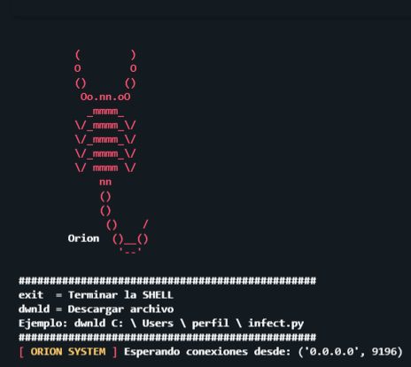
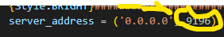
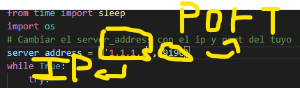

# -    Orion Shell    -

<p align="center">
<a href="https://gist.github.com/Apolo1061"></a>
<a href=""></a>
<a href="https://gist.github.com/Apolo1061"></a>
<a href="https://github.com/Apolo1061"></a>
<a href="https://github.com/Apolo1061"></a>

### Orion es un herramienta hecha en python3 que utiliza la biblioteca sockets para poder realizar una reverse shell a una maquina externa 

## 🛑 Aviso 🛑
### Orion shell es una herramienta realiza con fines educativos y ejemplificacion de una rever shell utilizando python3

## 🖥️ Comandos de orion 🖥️
* dwnld
#### Explicacion: Este sirve para poder descargar archivos que se encuentren en la maquina victima
#### Ejemplo:
```shell script
dwnld C:\user\perfil\flag.txt
```
* exit
#### Explicacion: Este comando sirve para poder terminal la reverse shell

## Instalacion

```shell script
git clone https://github.com/Apolo1061/orion-shellr.git
cd orion-shellr
```

# Uso
### Para poder realizar la rever shell primero tendrias que tener un dispositivo en el cual ejecutaras el server.py que sera el que recibira la conexion del infect.py entonces primero tendremos que modificar el siguiente campo

### En la parte que esta despues de la ip osea el numero que esta despues de 0.0.0.0 ese es el puerto hay pon un puerto el cual usaras

## Configuracion del infect.py
### Ahora lo que haras es lo siguente modificaras la parte de la ip y el port en estos pondras la ip de la maquina en la cual ejecutaste el server.py


# YO
[](https://github.com/Apolo1061)

## Requerimientos ▶

● Linux OS ( cualquier distribucion )

● Termux 

● Windows

● MAC